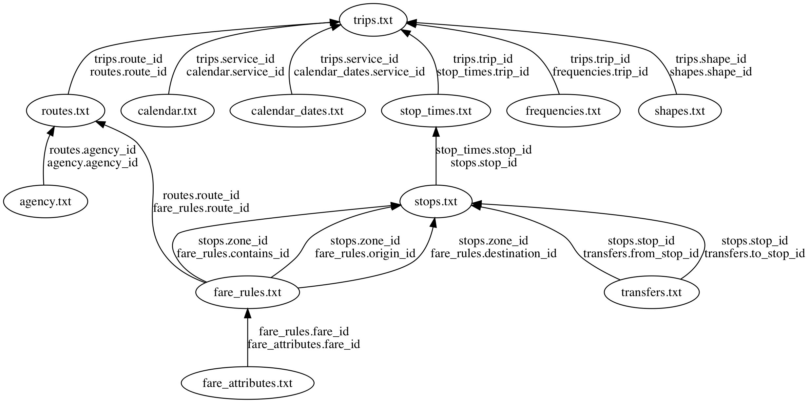

tidytransit
================

## Installation

You can install this package from github using `devtools`:

``` r
if (!require(devtools)) {
    install.packages('devtools')
}
devtools::install_github('r-transit/tidytransit')
```

## Examples

``` r
library(tidytransit)
library(dplyr)
```

### Reading GTFS Data into R

Fetch data for a bus system in Accra, Ghana from
GitHub.

``` r
accra_gtfs <- import_gtfs("https://github.com/AFDLab4Dev/AccraMobility/raw/master/GTFS/GTFS_Accra.zip")
```

Count and list the number of stops per route.

``` r
attach(accra_gtfs)

routes_df %>% inner_join(trips_df, by="route_id") %>%
  inner_join(stop_times_df) %>% 
    inner_join(stops_df, by="stop_id") %>% 
      group_by(route_long_name) %>%
        summarise(stop_count=n_distinct(stop_id)) %>%
  arrange(desc(stop_count))
```

    ## Joining, by = "trip_id"

    ## # A tibble: 271 x 2
    ##    route_long_name          stop_count
    ##    <chr>                         <int>
    ##  1 Kasoa ↔ Accra New Town          116
    ##  2 Omanjor ↔ Accra CMB             109
    ##  3 Manhean ↔ Accra CMB             105
    ##  4 Adeyman ↔ Abeka Lapaz           104
    ##  5 Ashongman ↔ Abeka Lapaz         101
    ##  6 Nungua ↔ Circle Odorna           91
    ##  7 Odorna ↔ Nungua                  91
    ##  8 Teshie-Nungua ↔ Achimota         91
    ##  9 Accra CMB ↔ Ablekuma             86
    ## 10 Kasoa ↔ Korle Bu                 84
    ## # ... with 261 more rows

### Calculate Headways

#### Import Data

We’ll use NYC MTA subway data to demonstrate headway calculations,
pulling directly from their
URL.

``` r
NYC <- import_gtfs("http://web.mta.info/developers/data/nyct/subway/google_transit.zip")
```

### Headway Statistics along a Route

List the routes with the shortest median headways.

``` r
route_frequency_summary <- route_frequency(NYC) %>%
  arrange(median_headways)

head(route_frequency_summary)
```

    ## # A tibble: 6 x 5
    ##   route_id median_headways mean_headways st_dev_headways stop_count
    ##   <chr>              <int>         <int>           <dbl>      <int>
    ## 1 GS                     4             4           0.01           4
    ## 2 L                      4             4           0.13          48
    ## 3 1                      5             5           0.14          76
    ## 4 7                      5             5           0.290         44
    ## 5 6                      6             7           2.84          76
    ## 6 E                      6            23          53.0           48

### Stop Headway Statistics

List the stops with the shortest headways in the system.

``` r
stop_frequency_summary <- stop_frequency(NYC, by_route=FALSE) %>%
  inner_join(NYC$stops_df) %>%
    select(stop_name, headway) %>%
      arrange(headway)
```

    ## Joining, by = "stop_id"

    ## Adding missing grouping variables: `direction_id`, `stop_id`

``` r
head(stop_frequency_summary)
```

    ## # A tibble: 6 x 4
    ## # Groups:   direction_id, stop_id [6]
    ##   direction_id stop_id stop_name             headway
    ##          <int> <chr>   <chr>                   <dbl>
    ## 1            0 902N    Times Sq - 42 St         3.60
    ## 2            1 901S    Grand Central - 42 St    3.60
    ## 3            1 902S    Times Sq - 42 St         3.60
    ## 4            0 901N    Grand Central - 42 St    3.61
    ## 5            0 702N    Mets - Willets Point     3.72
    ## 6            0 707N    Junction Blvd            3.72

### Map Data

We can add map data to the feed by joining the shapes together around
routes.

Lets see whats in the feed.

``` r
print(names(NYC))
```

    ##  [1] "agency_df"         "calendar_dates_df" "calendar_df"      
    ##  [4] "feed_info_df"      "frequencies_df"    "routes_df"        
    ##  [7] "shapes_df"         "stop_times_df"     "stops_df"         
    ## [10] "transfers_df"      "trips_df"          "validation"

Now lets turn the routes and stops tables in `simple features` data
frames:

``` r
NYC <- gtfs_as_sf(NYC)
```

Now we can map routes using a map package like `tmap`:

<!-- -->

We can also explore them interactively with a package like `mapview`

<!-- -->

## How GTFS Tables are Related

[Danny Whalen](https://github.com/invisiblefunnel) made a nice graph of the relationships among gtfs tables in the [partidge](https://github.com/remix/partridge) package for Python, copied below. This can be a very helpful guide as you try to get a grasp on the kinds of questions you might want to ask of transit schedule data. 


